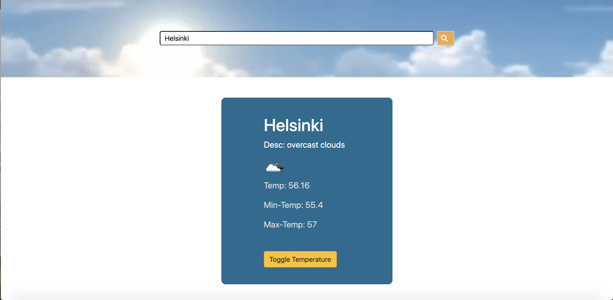

# Weather App

A weather forecast site using the weather API

## Built With

- HTML,
- CSS,
- JavaScript,
- Bootstrap
- Webpack

## Live demo Link

[live link]()

### Prerequisites

- Node
- Npm

### Setup

- Fork the repo to your remote repository.
- Clone or download the repository to your local machine.
- Run `npm install`
- Run `npm run build`

### Install

- No installation required.

## Authors

👤 **Rahma Halane**

- [Portfolio](https://raw.githack.com/imahnama/my-portfolio/develop/index.html)
- [Twitter](https://twitter.com/halane_rahma)
- [Linkedin](https://www.linkedin.com/in/rahmahalane/)
- [Email](mailto:Halane.rahma@gmail.com )

## 🤝 Contributing

Contributions, issues and feature requests are welcome!

Feel free to check the [issues page](https://github.com/imahnama/Weather-App/issues).

## Show your support

Give a ⭐️ if you like this project!
